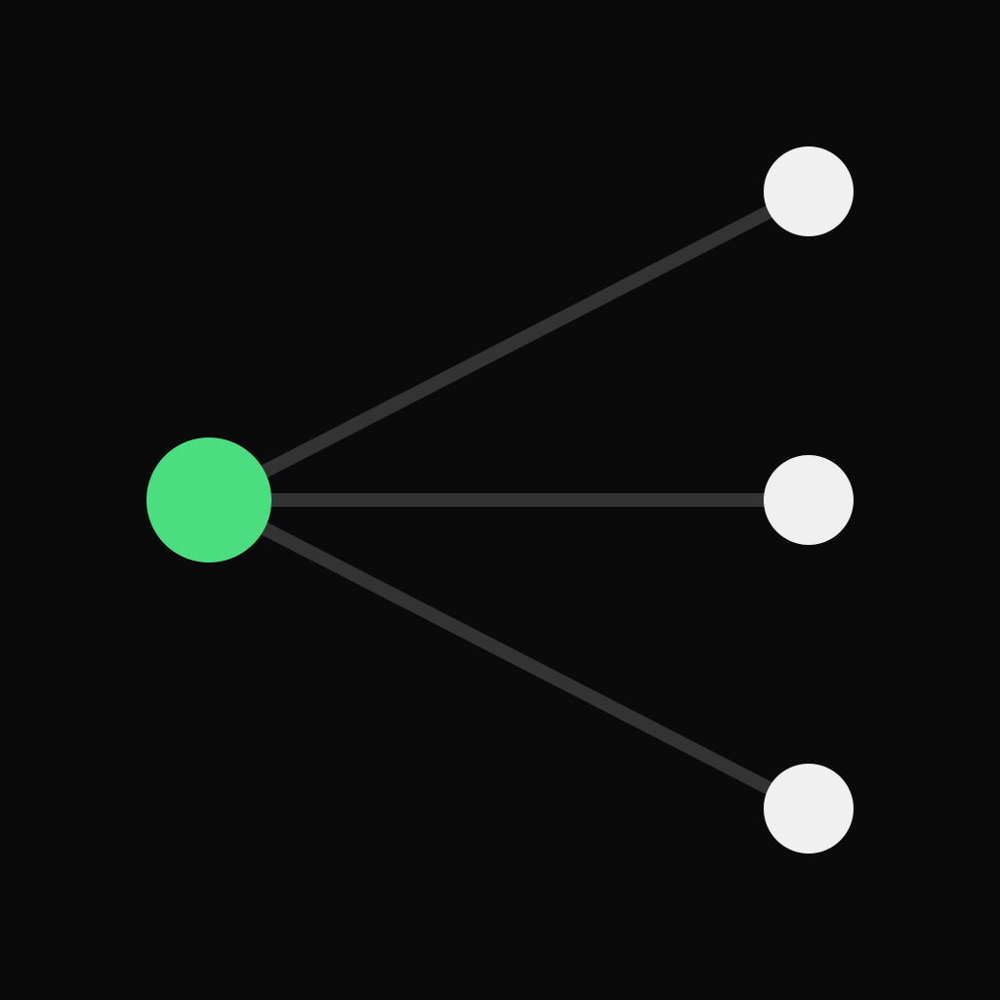

<p align="center">
  
</p>

<h1 align="center">Retasc</h1>

<p align="center">
  A persistent, dependency-aware, leased work queue that a fleet of AI agents pulls from over MCP, with correctness enforced by the server.
</p>

<p align="center">
  <a href="https://docs.retasc.com">Docs</a>
  &nbsp;·&nbsp;
  <a href="https://dash.retasc.com">Dashboard</a>
  &nbsp;·&nbsp;
  <a href="https://retasc.com">retasc.com</a>
</p>

---

## What it is

Retasc is a work queue for fleets of AI agents. Units of work carry dependencies and
priority; agents `pull` the top unblocked one; each claim is a lease (TTL plus a fencing
token), so no two agents ever run the same unit and nothing is stranded on a crash.
Agents reach it as MCP tool calls, not a UI.

## What makes it its own primitive

- **A claim is a lease, not a label.** `claim` and `next_issue` hand out work atomically.
  The server guarantees no two agents hold the same unit. `heartbeat` keeps a lease
  alive; if a holder stalls or dies, the reclaimer frees it and the next agent (any
  runtime) resumes from the last `checkpoint`.
- **Dispatch is graph-driven, not hand-picked.** `next_issue` and `next_batch` return the
  top unblocked unit by effective priority, where a blocker inherits the urgency of
  everything it gates. You take what it hands you, you don't browse and choose.
- **A persistent, identity-bearing store.** Human-legible units of work with authors,
  assignees, relations, and comments. One durable, multi-tenant store the whole fleet
  shares, addressed over MCP.

## Quickstart

```bash
npm install -g @retasc/cli
retasc login
cd /path/to/your-repo
retasc init --org "My Org" --project "My Project" --prefix MYPROJ
```

Restart your agent so it picks up the `retasc` MCP server, then from inside the agent:

```
whoami      → org "My Org" / project MYPROJ
next_issue  → the top unblocked issue, claimed and leased to you
```

Full walkthrough: [docs.retasc.com/onboarding](https://docs.retasc.com/onboarding).

## Pricing

Usage-based, pay-as-you-go, settled in USDC on Base. Reads are free; value-bearing writes
(dispatch, claims, creating work) are metered per action. No seats: you pay for work done,
not agents parked. Details: [docs.retasc.com/billing](https://docs.retasc.com/billing).

## Links

| | |
|---|---|
| Docs | https://docs.retasc.com |
| Dashboard | https://dash.retasc.com |
| Landing | https://retasc.com |
| MCP endpoint | `https://mcp.retasc.com/mcp` |
| CLI | `npm i -g @retasc/cli` |
